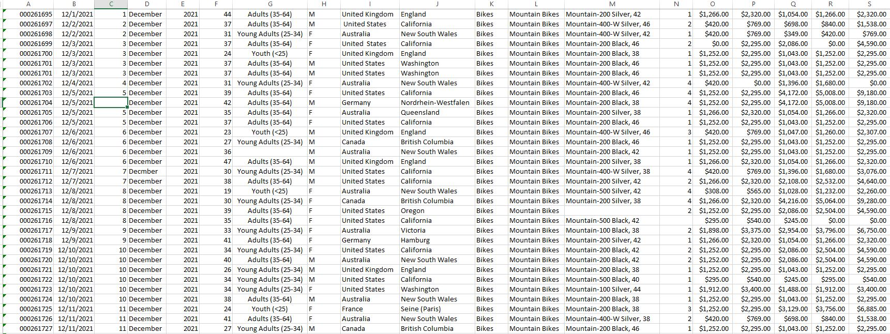
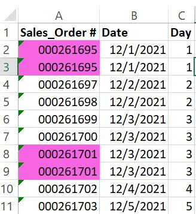
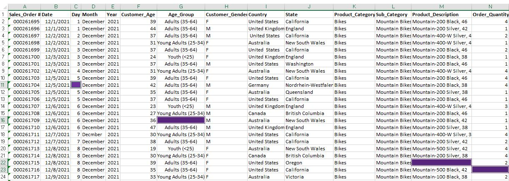
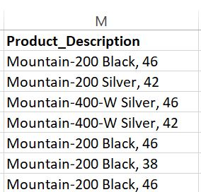
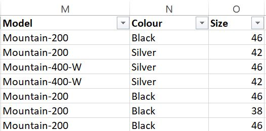
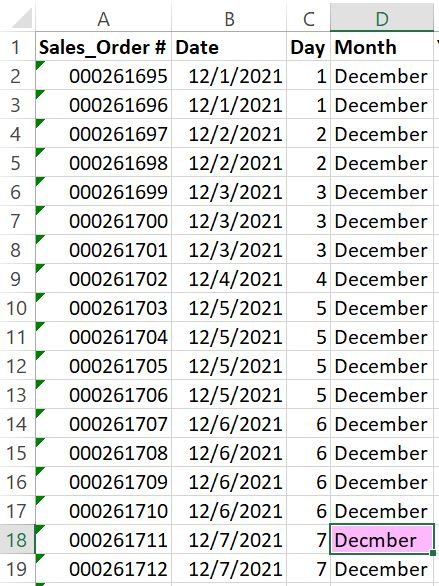
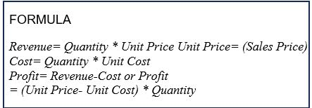
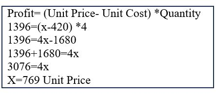
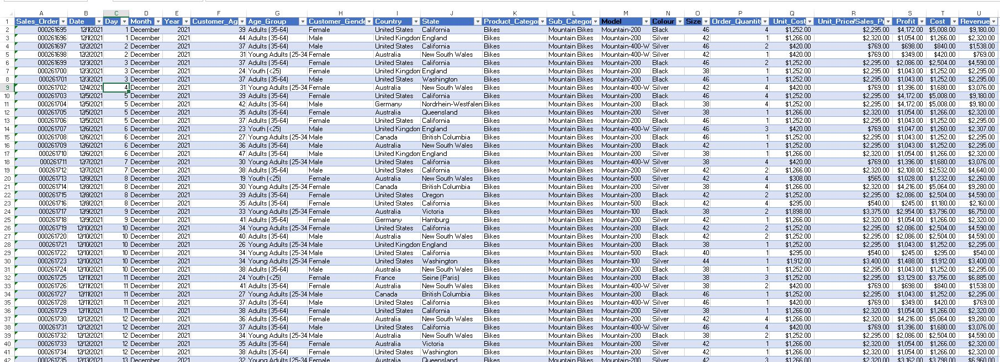

# DATA-CLEANING-BIKESALES
Here is my first project as a data analyst, and this was done using Microsoft Excel. The source of the dataset is through Data Analytics Essential by CISCO.
The dataset consists of 19 columns:

## DATA CLEANING PROCESS
Data is always messy, therefore it is very important to clean your data before any form of analysis or visualization is done, in order to have accurate results and make better insights/decisions for stakeholder.
Note: Every business needs this in order to make better decisions.

**Fixing and Removing Duplicates**: I found duplicates in Column A _**Sales_Order#**_ cells A2 and A3, cells A8 and A9. I reviewed the _**Sales_Order#**_ carefully. It appears that the _**Sales_Order#**_ of 000261695 was incorrectly entered into cell A3. The duplicate entry in cell A3, Sales Order# was changed to 000261696. For duplicate rows 8 and 9, one of the rows was removed/deleted.

**Blank cells**: using CTRL G and Conditional Formatting was used to highlight the 4 blank cells; C11, G16, M22, and N23. After reviewing the dataset carefully, the empty cells were filled with this data respectively; C11=5, G16=Adults (35–64), M22=Mountain-500 Black, 42, and N23=4

**Data Parsing from Text to Columns**: I splitted the column _**Product_Description**_ into two columns, _**Colour**_ and _**Size**_ respectively, using Text to Columns. Thereby changing the column name _**Product_Description**_ to _**Model**_.

 |

**Removing Extra Spaces**: I used the TRIM function in column J to remove excess spaces and tab spaces in Excel worksheet cells.
**Spell Check**: I used spell check from the Review tool bar, column D, cell D18 is spelt as Decmber 

**Possible Errors**: I carefully checked through the dataset and highlighted all the Unit Costs that are equal zero, cell Q6 and Unit Prices cell R9 . The Model Mountain-200 Black has a fixed Unit Cost of $1252.00

To get the Unit Price of cell R9;

Finally, the cleaned dataset is converted into a table format, which will then be summarized into a pivot table and charts for analysis and visualization.

